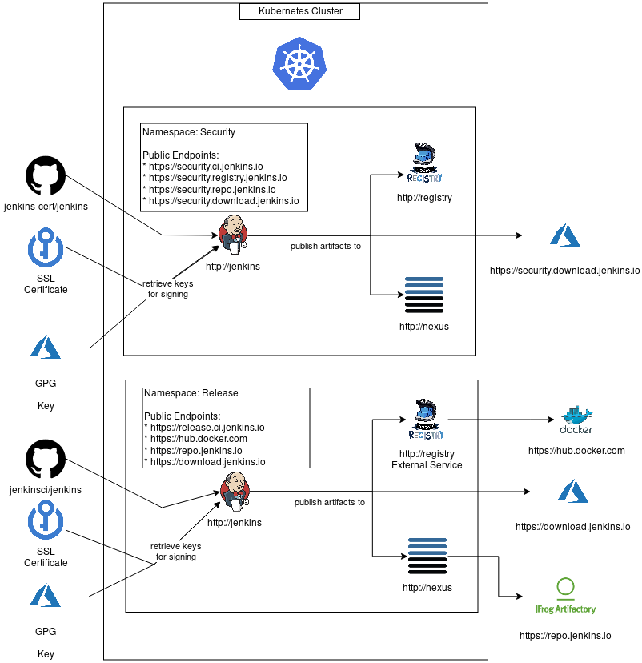

# Jenkins Release Environment

This is currently an **experimental** project.

This repository contains everything needed to configure an environment in order to build and release Jenkins versions.

The purpose of this project is to define the same process to build and release Jenkins regardless that we are in the 'release', 'security' or in any development environment.

The idea is to deploy, configure, and isolate all services needed to build and release a specific version inside a kubernetes namespace. So we can use the same internal endpoints everywhere (http://jenkins, http://nexus, http://registry,etc.) and use the kubernetes service type "externalName" to map an internal services like http://nexus to external services like https://repo.jenkins.io when needed.
 
The only thing that would need to change depending on the environment would be the credentials used to access those various services and a flag that define if we deploy services or just map some internal endpoint with an external services docker hub or repo.jenkins.io.

The benefits of this approach are multiple:

* The process to release a new version is totally transparent
* Everybody can deploy a release environment even on Minikube
* We can have a clear separation of who has access to which environment

The following diagram shows a big picture of what the environments could looks like where security environment deploy all services on kubernetes and 'release' just deploy a jenkins instance and the other services are mapped with external services.

## Diagram

## Requirements
In order to use this repository, you gonna need

* [kubernetes](https://github.com/kubernetes/minikube)
* [Jenkins-x](https://jenkins-x.io/)
* [Helm](https://www.helm.sh/)
  * [Plugin - Secrets](https://github.com/futuresimple/helm-secrets)
* [Sops](https://github.com/mozilla/sops)
* [Make](https://www.gnu.org/software/make/)
* [Azure Key Vault](https://azure.microsoft.com/en-us/services/key-vault/) with a ssl cert
* [Azure Blob Storage](https://azure.microsoft.com/en-us/services/storage/blobs/) with a password protected gpg key

## Usage
Once you have all the requirements, you can:

1. Create myvalues.yaml based on myvalues.release.yaml **! Never commit myvalues.yaml**
2. Install jenkins-x on your cluster `make init`
3. Install your build environment `make install`
4. Import your jenkins git repository `make import` (currently set to [olblak/jenkins](https://github.com/olblak/jenkins))
5. Retrieve your jenkins url `jx get urls`
6. Use jenkins password defined in myvalues.yaml or in ~/.jx/adminSecrets.yaml
7. Look at the build job

## TODO

### Jenkins
- [x] Jenkins should contains following plugins by default
  - [x] ssh-agent
  - [x] pipeline-utility-steps
  - [ ] ldap
 
### Artifactory
As of today, we use nexus repository as jenkins-x already deploys it by default

- [ ] Automate Artifactory configuration with:
  - [ ] A remote maven repository named 'repo1' in front of https://repo.jenkins-ci.org/repo1/, in order to retrieve and cache existing maven artifacts
  - [ ] A local maven repository named 'sandbox', in order to publish new artifacts and share them with collaborators 
- [ ] Install Artifactory service with different behaviour depending on the environment we are.
  - [ ] Default Artifactory service which redirect to local artifactory instance 
  - [ ] Release environment that defines an [ExternalName](https://kubernetes.io/docs/concepts/services-networking/service/#externalname) service type that redirect to [repo.jenkins-ci.org](https://repo.jenkins-ci.org/repo1)
- [ ] Configure [olblak/jenkins](https://github.com/olblak/jenkins/blob/master/Jenkinsfile.release)  to push artifacts on the local artifactory called 'artifactory'

### Azure
- [ ] Non-release environment should be able to sign with a dumb gpg certificate in order to remove Azure Storage Account requirement
- [ ] Non-release environment should be able to sign with a dumb ssl certificate in order to remove Azure Key Vault requirement

## Links

* [Documentation](https://github.com/jenkins-infra/iep/)
* [Jenkinsfile](https://github.com/olblak/jenkins/blob/master/Jenkinsfile.release)
* [Infrastructure](https://github.com/jenkins-infra/azure)

Various

* [ExternalName](https://cloud.google.com/blog/products/gcp/kubernetes-best-practices-mapping-external-services?hl=no) Service type 
* [Github Webhook Proxy](https://github.com/kubernetes/test-infra/blob/master/prow/cluster/ghproxy_deployment.yaml)
* [ssh-authentication-git](https://github.com/knative/docs/blob/master/build/auth.md#ssh-authentication-git)
* [PR](https://github.com/jenkins-x/jx/pull/1753)
* [SSO](https://github.com/jenkins-x/sso-operator)
